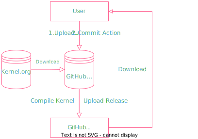

 # Kernel-Compile-On-Action
 [](https://github.com/LemonFan-maker/Kernel-Compile-On-Action/actions/workflows/main.yml)
 
 # 抱歉了，BUG暂无解决办法，直接Archive吧。
 
 # BUG提示区
 ## 目前直接编译v6.x的内核(极有可能)会出现``无效的shim签名，您需要先加载内核``的错误提示
 
 目的/功效/作用: 帮助你用**Github-Action**的服务器编译Kernel[^1].
 
 **重要:如果出现内核启动报错,无法正常进入系统,以及其他和内核有关的故障([见问题处理办法]()),与本人无关,请检查你的配置文件是否和自己电脑相符合**
 
**注意：** 在custom命名时不要输入中文和大写英文和任何符号，否则在打包时可能会发生错误(包括最新版内核)

## 食用方法
### 准备工作
1. 预编译[^2].
```sh
sudo su
# password
apt update && apt upgrade && apt install wget curl git fakeroot build-essential ncurses-dev xz-utils libssl-dev bc flex libelf-dev bison gcc make g++
wget https://mirrors.bfsu.edu.cn/kernel/vx.x/linux-x.xx.x.tar.xz
# wget https://mirrors.edge.kernel.org/pub/linux/kernel/vx.x/linux-x.xx.x.tar.xz
tar -xvf linux-x.xx.x.tar.xz # 'x.xx.x'为版本号
cd linux-x.xx.x
# make config # 不推荐，不是好方法.
# 以下俩二选一
make menuconfig # 合理的方法
make oldconfig # 保险的方法
# 选择要安装的modules，不要太多，否则编译会很慢，建议去掉一些没用的驱动.
```
2.重命名`.config`为`config`
3.上传预编译的`config`文件到仓库根目录(可以骗一骗commit记录~ :yum:)
### 可以开始了
1. 编译
2. 等待
3. 从*Release*下载deb文件
4. 安装
```sh
sudo su
# password
dpkg -i *.deb
# 当然，可以选择不安装*-dbg.deb
```
**提示**
可编译版本在[wiki](https://github.com/LemonFan-maker/Kernel-Compile-On-Action/wiki/Kernel_Versions)中有详细介绍
## 原理


[^1]: 不推荐编译5.0.0以下内核.当然，理论上应该也可以.
[^2]: 预先在本机编译config文件，上传到仓库.


